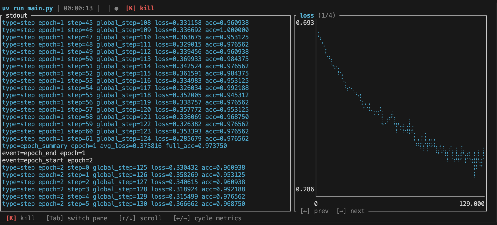

# mlc

ML training monitor. Wraps your training script, streams output, and gives some charts. Quick and easy. No Wandb, no changes to your code, just reading from terminal output.

## Quick Start

Install first:
```bash
curl -fsSL https://raw.githubusercontent.com/Malav-P/mlobs/main/install.sh | sh
```

Then run your training script:
```bash
mlc run python train.py --lr 1e-3
# OR
mlc run python main.py
# OR
mlc run <whatever your command is>
```





## Info
Run data is stored at `~/.mlc/runs`


## Uninstall
```bash
sudo rm /usr/local/bin/mlc
```